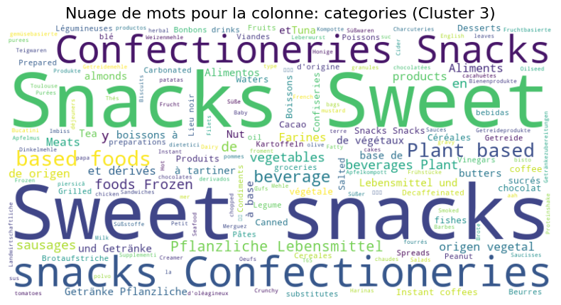
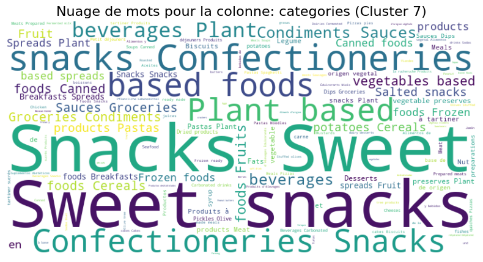
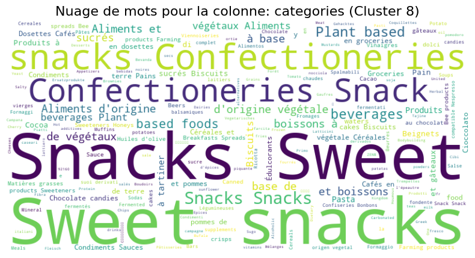
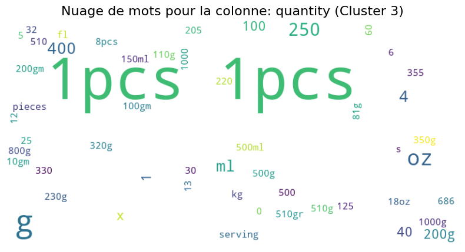

# Machine Learning

## Résultats K-means sur 1000 lignes

## Résultats K-means sur 10000 lignes

## t-SNE

### Comparatif entre les clusters

#### Catégories

|  |  |
|:---:|:---:|
|  |  |

#### Quantité

**Cluster n°4 :**
On peut remarquer que le cluster 4 est centré sur les unités de mesure et les quantités, avec une variété de termes liés aux poids et aux volumes. Il y a une présence liés aux volumes liquides.

**Cluster n°7 :**
On peut remarquer que le cluster 7 met en avant les termes liés aux unités de mesure et aux quantités, avec une mention notable des poids plus élevés. Il semble y avoir une tendance vers des quantités plus grandes et des poids plus lourds.

|  |  |
|:---:|:---:|
|  |  |

Les clusters sont fortement centrés sur les unités de mesure et les quantités. Les termes comme "g", "ml", "kg", "oz", et "1pcs" sont omniprésents, ce qui montre qu'il est très important de mesurer précisément dans les données. Les clusters montrent une variété de termes liés au poids et au volume, ce qui indique qu'il y a beaucoup de types de produits ou d'articles différents dans les données.

Il y a des différences entre les clusters. Par exemple, les clusters 3 et 4 se concentrent sur des unités de mesure standard et des quantités modérées. Ils incluent des termes liés aux petites et moyennes quantités, ce qui pourrait indiquer des produits de consommation courante. Le cluster 7, en revanche, met en avant des poids plus élevés et des quantités plus grandes, ce qui pourrait indiquer des produits industriels ou des articles en vrac. Le cluster 8 montre une tendance vers des volumes liquides plus importants, ce qui pourrait être lié à des produits comme des boissons ou des liquides en grande quantité.

### Améliorations 

Pour améliorer notre analyse de clustering, on pourrait commencer par ajuster le nombre de clusters. 
Par exemple, essayer de diviser les clusters 3 et 4 en sous-clusters pourrait nous montrer des différences dans les produits de consommation courante. Cela pourrait révéler des préférences des consommateurs ou les caractéristiques des produits.

 Ensuite, on pourrait faire une analyse plus approfondie des catégories en examinant les termes spécifiques dans chaque nuage de mots. Par exemple, dans le cluster 7, chercher des termes qui pourraient indiquer des sous-catégories de produits industriels pourrait nous aider à mieux comprendre les différents segments de marché.

Une autre idée serait d'utiliser des tableaux comparatifs pour visualiser les différences entre les clusters. Par exemple, comparer les  "g", "ml", et "kg" entre les clusters pourrait révéler des différences intéressantes dans les types de produits. Cela nous permettrait de voir plus clairement comment les unités de mesure et les quantités varient d'un cluster à l'autre.

En plus, on pourrait aussi utiliser un dataset plus gros pour améliorer notre analyse. Avec plus de données, on pourrait obtenir des clusters plus précis et découvrir des tendances qui ne sont pas visibles avec un dataset plus petit. Cela nous aiderait à avoir une vue plus complète et détaillée des différents segments de marché et des préférences des consommateurs. Nous remarquons qu'en dessous de 10 000 lignes les résultats ne sont pas cohérents.